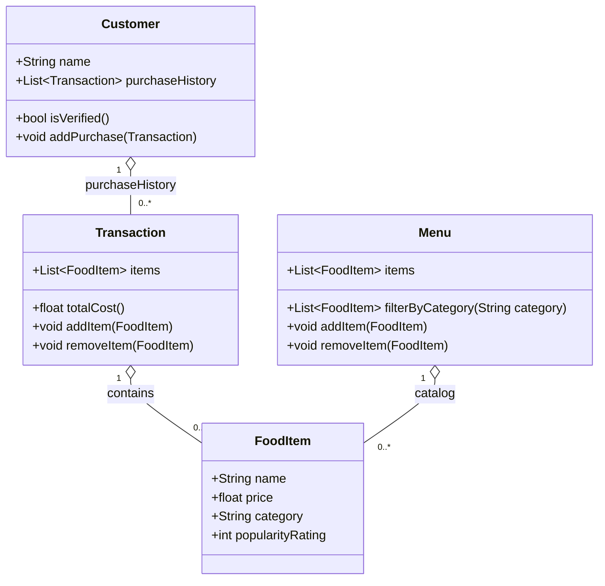

**Class Diagram (Mermaid)**

**Class Details**
- **`Customer`**: name; `purchaseHistory` (list of `Transaction`); methods: `isVerified()`, `addPurchase(Transaction)`.
- **`FoodItem`**: name, price, category, popularityRating.
- **`Menu`**: `items` (collection of `FoodItem`); `filterByCategory(String)` returns matching items; add/remove item helpers.
- **`Transaction`**: `items` (selected `FoodItem`s); `totalCost()` computes sum; add/remove item helpers.

